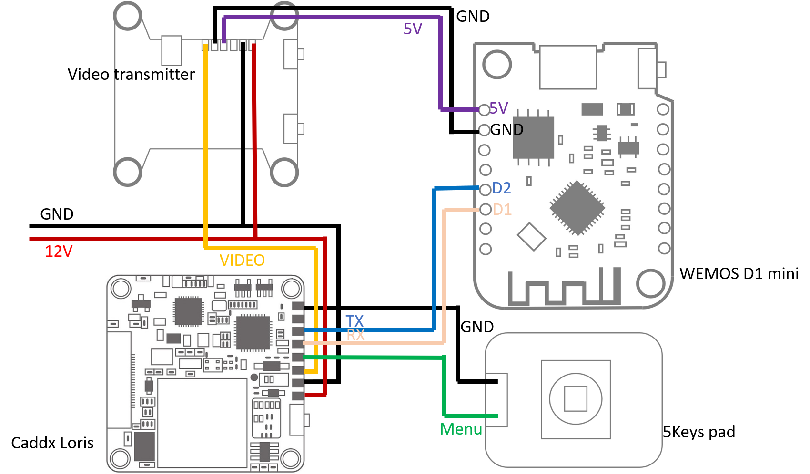

# Project onboard

Driver for my drone's onboard device.

An ESP8266 device plugged to TX/RX of the Caddx Loris Camera acts as a communication relay between Camera, 
flight controller and ground station.

## Needed tools 

Build this project you will need [PlatformIO](https://docs.platformio.org/en/latest/).

This project uses the [ESP8266 Arduino Framework](https://arduino-esp8266.readthedocs.io/en/latest/)

## Device description

### Wiring

Here is the basic wiring of the Wemos D1 with the other peripherals:

The video transmitter will provide the power supply, using its 5V output.

### Console

Device support multiple connexion. In that case, the message will be displayed in
all the connexions. The received command will be echoed to all connexions with a prefix
that display the origin of the command. See [Console commands](doc/consoleCommands.md) to 
known how to use it.

#### USB Serial

The default connexion to the device is to use the USB cable.
Then use a serial communication at 115200 bauds.

This is equivalent to plug cable to TX RX pins on the board. But, with the USB,
it also provides power to the board.

#### Telnet

If the device network is connected, then the console may also be accessible through a telnet connexion.
To connect to the device simply connect to its IP port 23 with the Telnet protocol.
Only one telnet client at a time is supported by the device.

### webserver

If the device network is connected, a simple web server is running on port 80.

### Runcam Camera

Caddx Loris uart port allow communication to Wemos through D1, D2 pins.

More details about Runcam protocol and Loris specific [here](doc/RuncamProtocol.md).

More details about the Driver functions: [here](doc/RuncamDriver.md)

### Remote control

The remote control uses 4 wires to control the device.

More details can be found [here](doc/remoteDevice.md)

