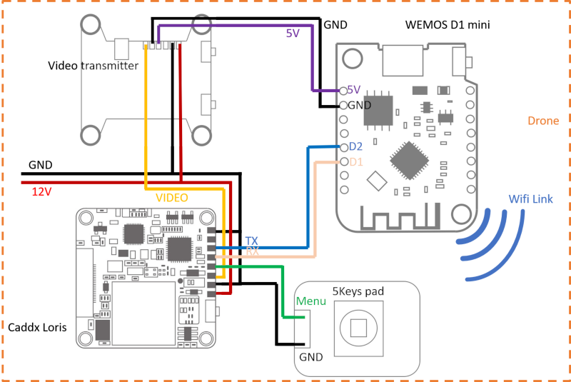
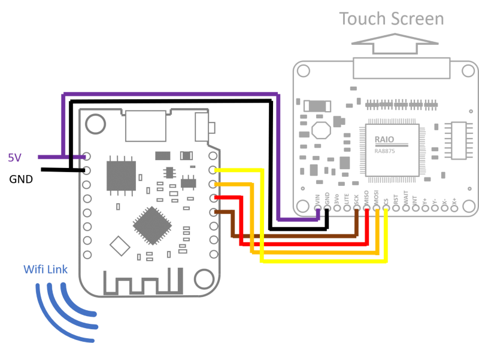

# Project onboard

## Introduction

### Goals

This project intent to allow more links between the drone and On board peripherals.

It consists in Two modules, one on the drone, the second with the pilot 
(or any other ground operator).

### Motivation

The first motivation to start this project cames when I added a camera to my drone,
but was unable to control it (typically start/stop recording). My flight controler 
does not have enough ports to plug everything.

## Needed tools 

Build this project you will need [PlatformIO](https://docs.platformio.org/en/latest/).

This project uses the [ESP8266 Arduino Framework](https://arduino-esp8266.readthedocs.io/en/latest/)

## Devices description

The base of the system is the communication between two modules.
To do that we will use 2 ESP8266 and their Wi-Fi capabilities.

The device on the drone will be used to control the Camera. 
The device on the ground will be connected to a touch screen displaying information 
and use as human interface.

### Wiring the device 'onboard'

Here is the basic wiring of the Wemos D1 with the other peripherals:

The video transmitter will provide the power supply, using its 5V output.

### Writing the device 'controler'

Here is the basic wiring of the Wemos D1 with the other peripherals:

The power supply will most likely be given by a battery.

## Code architecture

The code architecture between the 2 device will be very similar sharing most parts.

The detail description is on this page: [Code Architecture](srcdoc/CodeArchitecture.md)

## The hardware devices

### Runcam Camera

Caddx Loris uart port allow communication to Wemos through D1, D2 pins.

More details about Runcam protocol and Loris specific [here](srcdoc/RuncamProtocol.md).

More details about the Driver functions: [here](srcdoc/RuncamDriver.md)

### RAIO RA8875

The RA8875 is plugged using the hardware SPI bus.

More details about the Driver functions: [here](srcdoc/RA8875.md)
