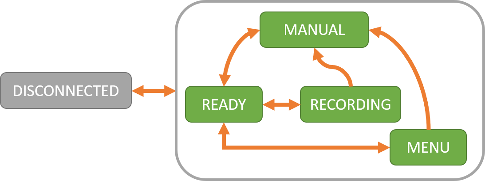
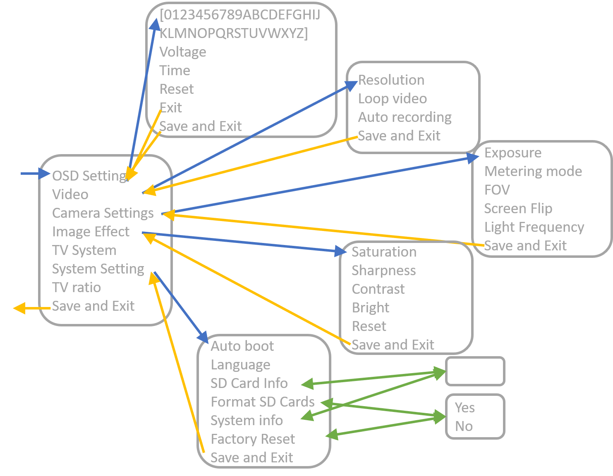

# RunCam driver statuses and functions

## The control status

We set up different statuses for the camera device:

 | status         |  description |
 | -------------- |  :---------- |
 | `DISCONNECTED` |  The device cannot be contacted. |
 | `READY`        |  Camera mode. |
 | `RECORDING`    |  Camera mode and recording in progress. |
 | `MENU`         |  The camera is in menu. |
 | `MANUAL`       |  The camera is manually controlled. |

The following image describes the possible path between statuses:

## Utility functions:

 | status           | Required State | new state   |  description |
 | ---------------- | -------------- | ----------- | :---------- |
 | `getDeviceInfo`  | all            | if (timeout) { `DISCONNECTED` } elif ( `DISCONNECTED` & response) { `READY`} else {no change} | send an info request,wait for response. (can be used to check connection) |
 | `setManual`      | `READY`, `RECORDING` & `MENU` | `MANUAL` | Set the camera to manual mode do not track for any camera change |
 | `unsetManual`    | `MANUAL`       | `READY`     | Restore Camera in `READY` after manual operations |
 | `resetState `    | all            | `READY`     | Reset the state of the camera to `READY` state |
 | `startRecording` | `READY`        | `RECORDING` | Start the video recording. |
 | `stopRecording`  | `RECORDING`    | `READY`     | Stop the video recording. |
 | `openMenu`       | `READY`        | `MENU`      | Open the camera menu, begin the track of the menu navigation. |
 | `moveLeft`       | `MENU`         | no change or `READY` | Navigate left in the menu (similar to validate). |
 | `moveRight`      | `MENU`         | no change or `READY` | Navigate right in the menu (similar to validate). |
 | `moveset`        | `MENU`         | no change or `READY` | Navigate set in the menu (similar to validate). |
 | `moveUp`         | `MENU`         | no change   | Navigate up in the menu. |
 | `moveDown`       | `MENU`         | no change   | Navigate down in the menu. |

## Menu

Here is a map of the menus of the Caddx Loris:

